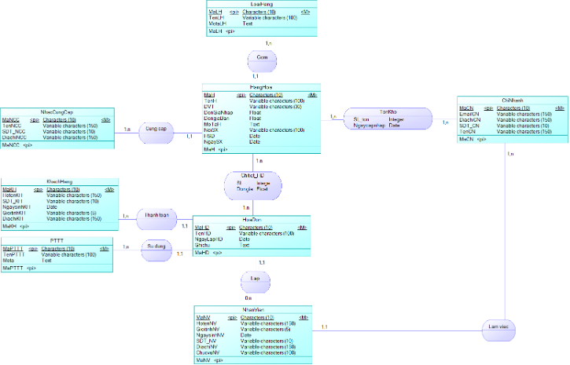
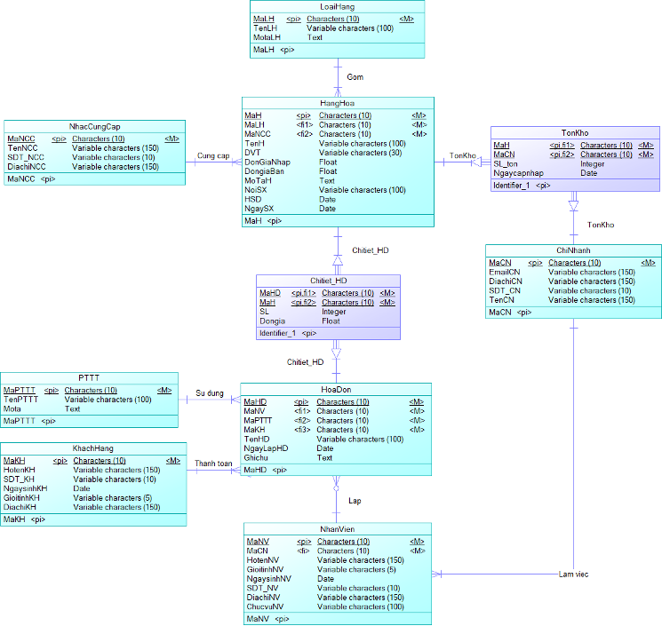
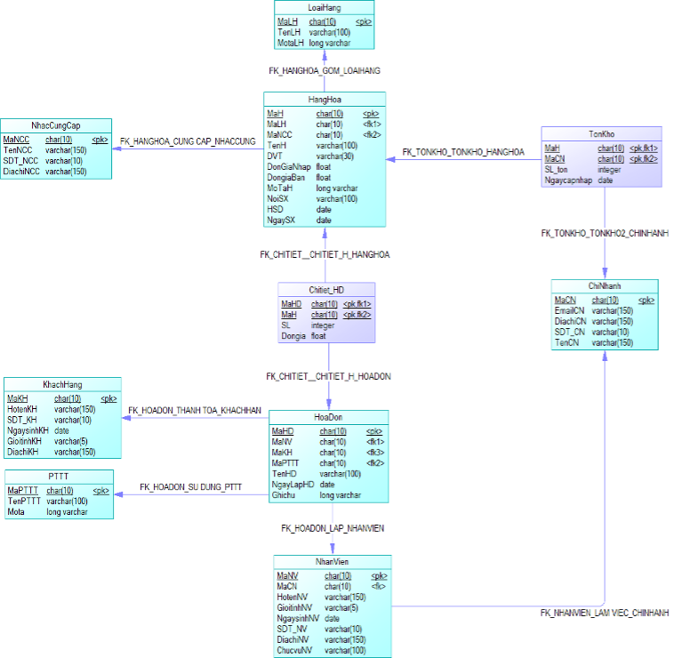
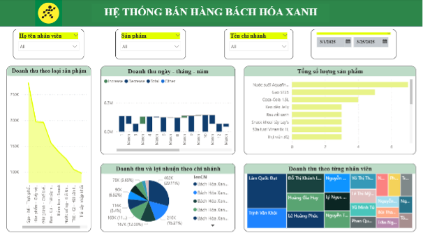

# Project-SQL-Server

## Giới thiệu
Dự án được thực hiện trong học phần Hệ Quản Trị Cơ Sở Dữ Liệu SQL Server nhằm xây dựng cơ sở dữ liệu quản lý bán hàng cho chuỗi cửa hàng Bách Hóa Xanh.

Hệ thống hỗ trợ quản lý hàng hóa, khách hàng, nhân viên, hóa đơn, tồn kho và các hoạt động thống kê doanh thu. Cơ sở dữ liệu được thiết kế trên Microsoft SQL Server với đầy đủ các thành phần như View, Function, Stored Procedure, Trigger, Index, Synonym và phân quyền người dùng.

## Mục tiêu dự án
- Thiết kế cơ sở dữ liệu quản lý bán hàng theo mô hình chuẩn hóa
- Xây dựng mô hình ERD, LDM và PDM
- Tạo các bảng dữ liệu cùng khóa chính, khóa ngoại và ràng buộc toàn vẹn
- Xây dựng các đối tượng SQL Server hỗ trợ xử lý nghiệp vụ
- Tối ưu truy vấn bằng Index
- Quản lý phân quyền người dùng theo vai trò
- Kết nối dữ liệu với Power BI để trực quan hóa báo cáo

## Thiết kế cơ sở dữ liệu
### Sơ đồ ERD

### Mô hình dữ liệu Logic (LDM)

### Mô hình dữ liệu Vật lý (PDM)

### Diagram Database

## Dashboard Power BI

## Kết quả đạt được
- Xây dựng hoàn chỉnh cơ sở dữ liệu quản lý bán hàng trên SQL Server
- Đảm bảo tính toàn vẹn dữ liệu bằng các ràng buộc và Trigger
- Tối ưu truy vấn bằng Index
- Tự động hóa nghiệp vụ bằng Function và Stored Procedure
- Phân quyền người dùng theo vai trò
- Trực quan hóa dữ liệu kinh doanh bằng Power BI
